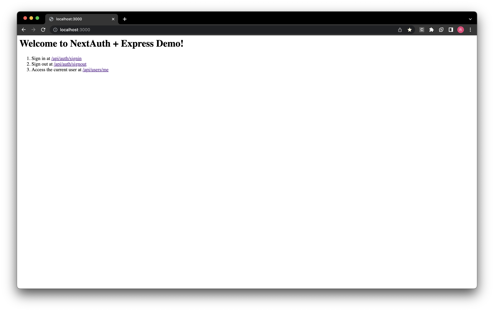

# next-auth-express-demo

This demo show-cases an approach to using NextAuth in an Express backend.



# Development

1. Install dependencies with
   ```bash
   pnpm install
   ```
   > The project uses `pnpm` but you can also install dependencies with `npm` or `yarn`
2. Run the development server
   ```bash
   pnpm dev
   ```

# How It Works

1. First create a router that bundles together all of `next-auth`'s authentication routes and functionality. In this demo, the generic router is defined in `src/routes/auth.routes.ts`.
2. Next, we make sure to use or apply 3 important middleware to the application. These include `express.json()`, `cookieParser()`, and `express.urlencoded()`.
3. After these are in place, we `app.use(nextAuthRouter({ basePath: "/api/auth", authOptions }))` by providing it a base path and `authOptions` (as you would in Next.js)
4. Finally, make sure to define all required environment variables for `next-auth` and its providers, similar to those in `.env.example`

With that everything is good to go!

# Why Does this Work?

The Next.js Pages Router and Express Framework extend the same `Request` and `Response` interfaces with additional some common functionality. While the compatibility is not 1:1, it is enough such that `next-auth` (v4) is cross-compatible.

> For example, methods such as `res.send()`, and `res.json()` are implemented across both response types. However methods such as `res.revalidate()` exist in Next.js land only. This is okay since the method is not used in NextAuth (v4).

Aside these interface differences, there are two caveats with Express:

1. Making sure we apply some middleware functions (Step 2) in order to parse and fill some request object properties in Express.
2. Manually parsing the request path into the [Catch-all Dynamic Segments](https://nextjs.org/docs/pages/building-your-application/routing/dynamic-routes#catch-all-segments) as is done automatically in Next.js. This is specifically [relied on by NextAuth](https://github.com/nextauthjs/next-auth/blob/f48eb0478ed60d11e9c42b9978aa2f938d6598d9/packages/next-auth/src/next/index.ts#L27).

# Acknowledgements

This demo was adapted from:

- [Hasura](https://github.com/zenflow/hasura-node-monolith-example/blob/2d95df91a8f049c065824cabfbdaacabb16be6b7/auth/routes/next-auth.js)
